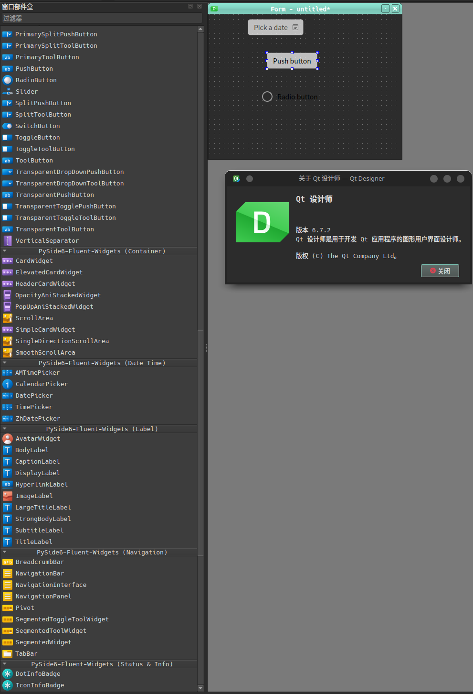
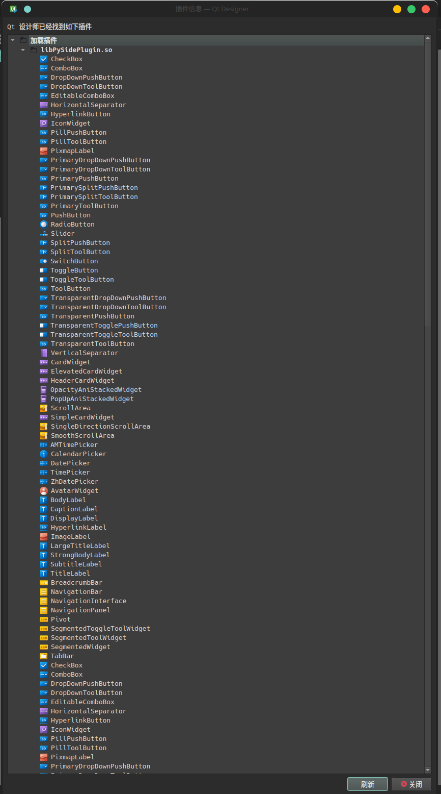

# PySide6-Fluent-Widgets-plguin
The qt-designer plugin of PySide6-Fluent-Widgets

I have tried to make a [pull request](https://github.com/zhiyiYo/PyQt-Fluent-Widgets/pull/781) to the [main repository](https://github.com/zhiyiYo/PyQt-Fluent-Widgets), but it was been **delete** (instaed of closing). So I have to create this repository.

## Usage
Simply run `python designer.py`

### Troubleshooting
The menu item Help/About Plugin brings up a dialog showing the plugins found and potential load error messages. If you get the error message like `无法加载库 python3.11/site-packages/PySide6/Qt/plugins/designer/libPySidePlugin.so：python3.11/site-packages/PySide6/Qt/plugins/designer/libPySidePlugin.so: undefined symbol: Py_Finalize`, don't worry, you are not alone. :joy: I have no idea about where is wrong, but I found I can solve it by simply creating a new environment with the lastest version of Python(This problem happend on python 3.11, but disappeared on python 3.12).

Besides, if you are using this plugin on windows, there is a likelihood that your designer may encounter unexpected crashes. I have [reported this to qt](https://bugreports.qt.io/browse/PYSIDE-2669) and tried to find out the reason, but I failed.